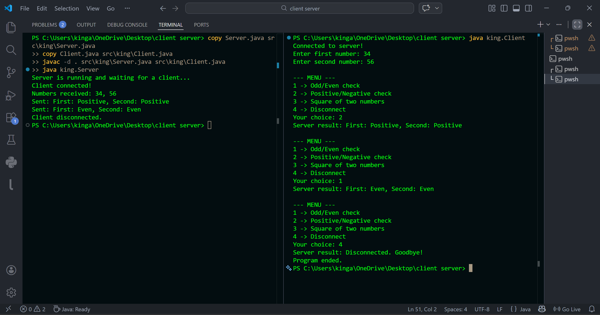

<div align="center">
  

  <h1>🖧 Java Client-Server Chat Application</h1>
  <p><strong>A Socket-Based Network Application for Real-Time Client-Server Communication</strong></p>

  <p>
    <a href="https://www.java.com/"></a>
    <a href="https://docs.oracle.com/javase/8/docs/api/java/net/Socket.html"></a>
    <a href="https://code.visualstudio.com/"></a>
    <a href="#"></a>
  </p>
</div>

---

## 📖 About The Project

This **Java Client-Server Application** demonstrates core concepts of **socket programming** and **network communication** using Java's `java.net` package. The server listens on a dedicated port, accepts an incoming client connection, receives two numbers, and performs multiple arithmetic/logical operations on demand — all over a live TCP socket connection.

The project is ideal for understanding how real-world networked applications communicate, how data is sent and received over sockets, and how a persistent session loop enables multiple operations without reconnecting.

---

## ✨ Features

### 🖥️ Server Side
- **📡 Socket Listener:** Starts a `ServerSocket` on port `20074` and waits for client connections.
- **🔢 Number Processing:** Receives two integers from the client and holds them in memory for the session.
- **🔁 Persistent Loop:** Keeps the connection alive and serves multiple operations in a single session.
- **📤 Result Dispatch:** Computes and sends results back to the client after every operation.
- **🔌 Clean Disconnect:** Gracefully closes the connection when the client sends choice `4`.

### 💻 Client Side
- **🔗 Auto Connect:** Connects to the server on `localhost:20074` automatically on startup.
- **📥 Number Input:** Takes two integers from the user and sends them to the server.
- **📋 Interactive Menu:** Displays an operation menu repeatedly until the user disconnects.
- **📨 Live Results:** Receives and displays the server's computed result in real time.

---

## 🛠️ Operations Supported

| Choice | Operation | Example Output |
| :---: | :--- | :--- |
| **1** | Odd / Even Check | `First: Even, Second: Even` |
| **2** | Positive / Negative Check | `First: Positive, Second: Positive` |
| **3** | Square of Both Numbers | `Square of first: 1156, Square of second: 3136` |
| **4** | Disconnect Client & Server | `Disconnected. Goodbye!` |

---

## 🏗️ Technical Stack

| Technology | Usage |
| :--- | :--- |
| **Java** | Core programming language |
| **java.net.Socket** | Client-side TCP socket connection |
| **java.net.ServerSocket** | Server-side connection listener |
| **java.io.BufferedReader** | Reading data from the socket stream |
| **java.io.PrintWriter** | Writing/sending data over the socket |
| **java.util.Scanner** | Reading user input from the console |

---

## 📁 Project Structure

```
java-client-server-app/
├── src/
│   └── king/
│       ├── Server.java       # Server-side socket logic
│       └── Client.java       # Client-side socket logic
├── images/
│   └── output.png            # Output screenshot
├── .gitignore                # Ignores .class files
└── README.md
```

---

## ⚙️ How To Run

### 📋 Prerequisites
- **Java JDK** installed (version 8 or above)
- **VS Code** with **Extension Pack for Java** installed
- Two terminal windows (split terminal recommended)

---

### 🚀 Step-by-Step Setup

#### Step 1 — Create folder structure
```bash
mkdir -p src\king
```

#### Step 2 — Copy files into the package folder
```bash
copy Client.java src\king\Client.java
copy Server.java src\king\Server.java
```

#### Step 3 — Compile both files
```bash
javac -d . src\king\Server.java src\king\Client.java
```

#### Step 4 — Start the Server (Terminal 1)
```bash
java king.Server
```

#### Step 5 — Open a second terminal
Press `Ctrl + Shift + 5` in VS Code to split the terminal.

#### Step 6 — Start the Client (Terminal 2)
```bash
java king.Client
```

---

## 🖥️ Output Screenshot




## ⚠️ Important Notes

> **Always start the Server before the Client.**  
> If the Client is started first, it will throw a `Connection refused` error because there is no server listening yet.

> **Port used:** `20074` — make sure no other application is using this port.

---


## 👨‍💻 Author

Made with ☕ and Java Sockets.

---

<div align="center">
  <p>⭐ If you found this helpful, give it a star on GitHub!</p>
</div>
